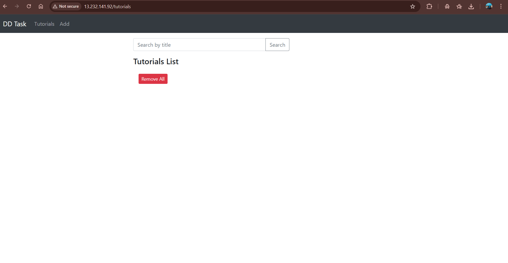
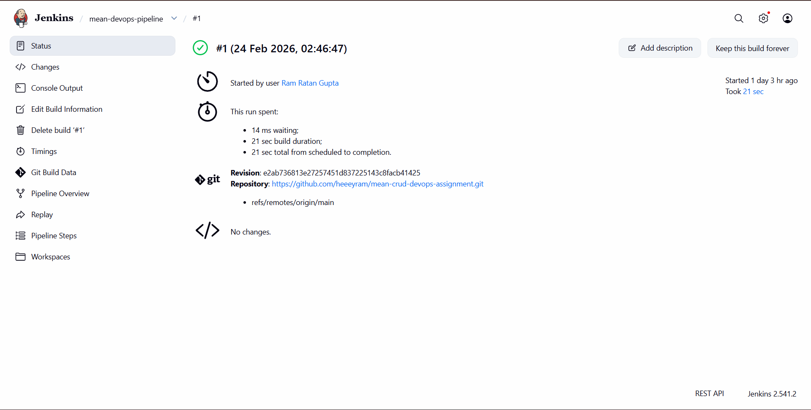
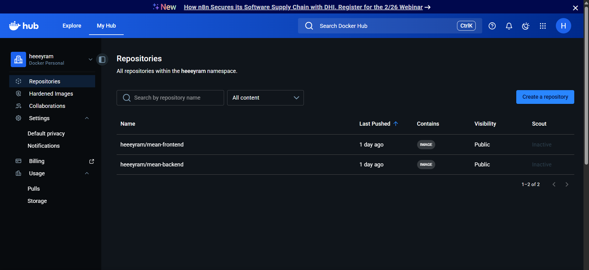
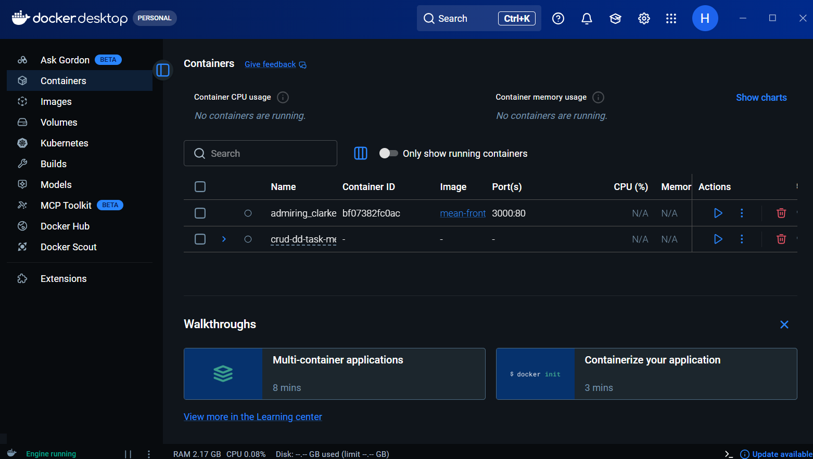
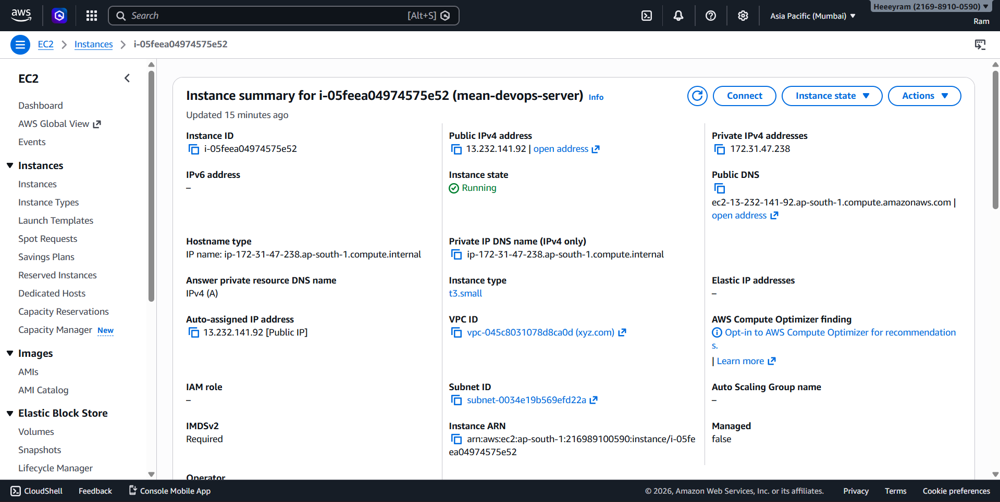

# 🚀 MEAN Stack DevOps Deployment with CI/CD

> End-to-end containerization, CI/CD automation, and cloud deployment of a full-stack MEAN application — accessible via Port 80 through an Nginx reverse proxy.

---

## 📋 Table of Contents

- [Project Overview](#project-overview)
- [Tech Stack](#tech-stack)
- [Architecture Overview](#architecture-overview)
- [Repository Structure](#repository-structure)
- [Docker Compose Deployment](#docker-compose-deployment)
- [CI/CD Pipeline (Jenkins)](#cicd-pipeline-jenkins)
- [Cloud Infrastructure](#cloud-infrastructure)
- [How to Run Locally](#how-to-run-locally)
- [Screenshots](#screenshots)

---

## 📌 Project Overview

A full-stack MEAN application for managing **Tutorials** — with full CRUD operations and title-based search, containerized and deployed on AWS EC2 with an automated Jenkins CI/CD pipeline.

**What was implemented:**
- Dockerized frontend and backend services
- Multi-container orchestration via Docker Compose on AWS EC2
- Jenkins CI/CD pipeline — auto builds, pushes, and deploys on every Git push
- Nginx reverse proxy serving the entire app on Port 80
- MongoDB running as a Docker container with persistent storage

---

## 🛠️ Tech Stack

| Layer              | Technology                              |
|--------------------|-----------------------------------------|
| Frontend           | Angular 15                              |
| Backend            | Node.js + Express.js                    |
| Database           | MongoDB (Official Docker Image)         |
| Containerization   | Docker, Docker Compose                  |
| CI/CD              | Jenkins                                 |
| Image Registry     | DockerHub                               |
| Cloud              | AWS EC2 (Ubuntu 22.04)                  |
| Reverse Proxy      | Nginx                                   |

---

## 🏗️ Architecture Overview

```
Developer Push → GitHub → Jenkins CI/CD
                               │
                    ┌──────────▼──────────┐
                    │  Build Docker Images │
                    │  Push to DockerHub   │
                    │  SSH → EC2 → Deploy  │
                    └──────────┬──────────┘
                               │
                    ┌──────────▼──────────┐
                    │   AWS EC2 (Port 80)  │
                    │       Nginx          │
                    │    ┌────┴────┐       │
                    │ Frontend  Backend    │
                    │               │      │
                    │           MongoDB    │
                    └─────────────────────┘
```

---

## 📁 Repository Structure

```
mean-crud-devops-assignment/
├── backend/            # Node.js + Express REST API
├── frontend/           # Angular 15 application
├── nginx/              # Nginx reverse proxy config
├── screenshots/        # Deployment & pipeline screenshots
├── docker-compose.yml  # Multi-container orchestration
├── Jenkinsfile         # CI/CD pipeline definition
└── README.md
```

---

## ⚙️ Docker Compose Deployment

Four services orchestrated via `docker-compose.yml`:

| Service    | Role                         |
|------------|------------------------------|
| `frontend` | Serves the Angular app       |
| `backend`  | Runs the Node.js/Express API |
| `mongodb`  | Managed MongoDB container    |
| `nginx`    | Reverse proxy on port 80     |

```bash
docker compose pull
docker compose down
docker compose up -d --remove-orphans
```

---

## 🔄 CI/CD Pipeline (Jenkins)

Triggers automatically on every push to `main`.

```
Clone Repo → Build Images → Push to DockerHub → SSH into EC2 → Restart Containers → ✅ Live
```

**Jenkins Credentials Configured:**

| Credential ID     | Type                | Purpose                  |
|-------------------|---------------------|--------------------------|
| `dockerhub-creds` | Username & Password | DockerHub authentication |
| `ec2-ssh-key`     | SSH Private Key     | EC2 VM access via SSH    |

> No sensitive credentials are stored inside the repository.

---

## ☁️ Cloud Infrastructure

- **Platform:** AWS EC2 — Ubuntu 22.04 LTS
- **Security Group Rules:** Port 22 (SSH) · Port 80 (HTTP)

> The EC2 instance is preserved and available to restart for live demonstration.

---

## 💻 How to Run Locally

```bash
git clone https://github.com/heeeyram/mean-crud-devops-assignment.git
cd mean-crud-devops-assignment
docker compose up --build
```

App available at → `http://13.232.141.92`

---

## 📸 Screenshots

| Description                         | Screenshot                                       |
|-------------------------------------|--------------------------------------------------|
| Application UI — Tutorial List      |               |
| Jenkins Pipeline — Successful Run   |    |
| DockerHub — Pushed Images           |  |
| Docker Compose — Running Containers |   |
| EC2 Instance — Running              |            |

---

## 👤 Author

**Raghunath** — DevOps Internship Assignment  
GitHub: [@heeeyram](https://github.com/heeeyram)

---

> ⚡ Submitted as part of the Discover Dollar DevOps Internship Technical Assignment — February 2026
